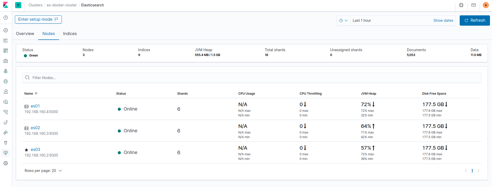

# Secure Docker ELK cluster

An end-to-end fully secure Elasticsearch cluster (of 3 Elasticsearch instances) with Kibana and run by Docker. Using official images. Ever dreamed of the following ?



First, you will need to raise your host's ulimits for Elasticsearch to be able to handle high I/O :

```console
sudo sysctl -w vm.max_map_count=500000
```

Now, we will generate the certificates for your cluster :

```console
docker-compose -f create-certs.yml run --rm create_certs
```

That's it ! Start the cluster with :

```console
docker-compose up -d
```

Access Kibana through [https://localhost:5601](https://localhost:5601)

> Default username is `elastic` and password is `changeme`
